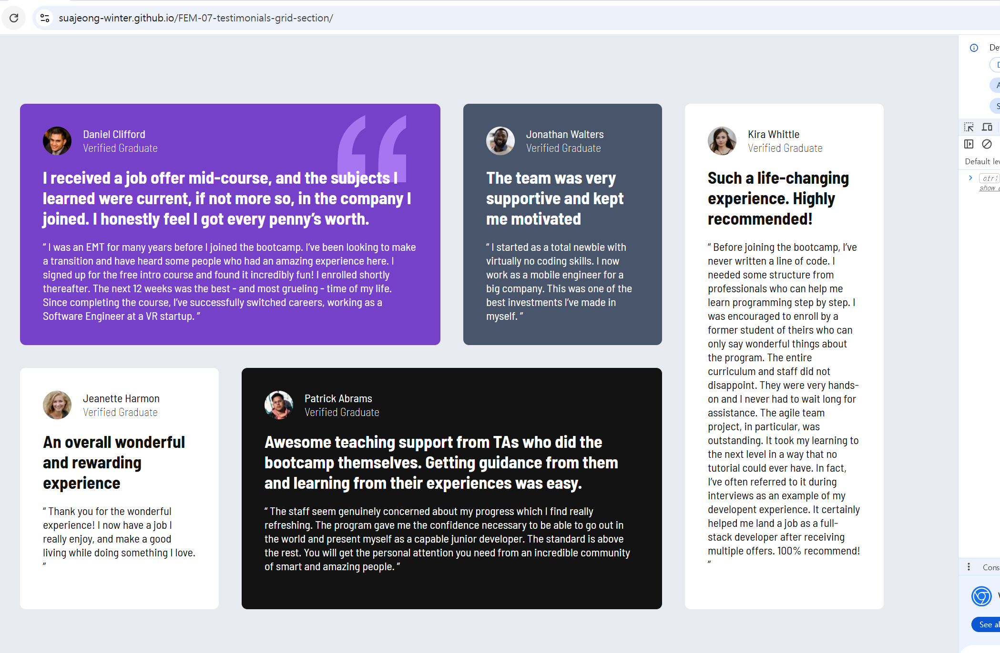
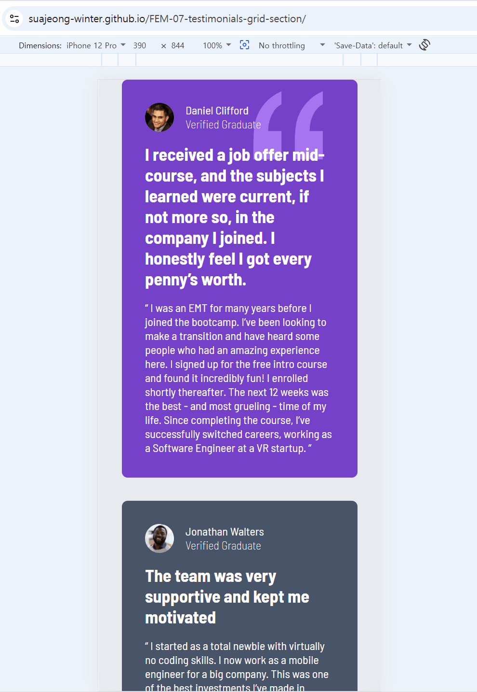

# Frontend Mentor - Testimonials grid section solution

This is a solution to the [Testimonials grid section challenge on Frontend Mentor](https://www.frontendmentor.io/challenges/testimonials-grid-section-Nnw6J7Un7). Frontend Mentor challenges help you improve your coding skills by building realistic projects.

## Table of contents

- [Overview](#overview)
  - [The challenge](#the-challenge)
  - [Screenshot](#screenshot)
  - [Links](#links)
- [My process](#my-process)
  - [Built with](#built-with)
  - [What I learned](#what-i-learned)
  - [Continued development](#continued-development)
  - [Useful resources](#useful-resources)
  - [AI Collaboration](#ai-collaboration)
- [Author](#author)

**Note: Delete this note and update the table of contents based on what sections you keep.**

## Overview

### The challenge

Users should be able to:

- View the optimal layout for the site depending on their device's screen size

### Screenshot

### Links

- Solution URL: [solution URL](https://github.com/SuaJeong-winter/FEM-07-testimonials-grid-section)
- Live Site URL: [live site URL](https://suajeong-winter.github.io/FEM-07-testimonials-grid-section/)

## My process

### Built with

- Semantic HTML5 markup
- CSS custom properties
- CSS Grid!!!
- Mobile-first workflow

### What I learned

I learned Grid and Flexbox by reading several docs, videos and practicing examples

### Continued development

Maybe...making the layout more adaptive across different device sizes?

### Useful resources

- [mdn grid docs](https://developer.mozilla.org/en-US/docs/Web/CSS/Reference/Properties/grid)
- [Josh Comeau Grid](https://www.joshwcomeau.com/css/interactive-guide-to-grid/)

### AI Collaboration

Describe how you used AI tools (if any) during this project. This helps demonstrate your ability to work effectively with AI assistants.

- What tools did you use (e.g., ChatGPT, Claude, GitHub Copilot)? github copilot, chat gpt
- How did you use them (e.g., debugging, generating boilerplate, brainstorming solutions)? debugging, brainstorming solutions
- What worked well? What didn't? It worked well

## Author

- Website - [정수아Jeong Sua](https://github.com/SuaJeong-winter)
- Frontend Mentor - [@SuaJeong-winter](https://www.frontendmentor.io/profile/SuaJeong-winter)
